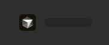
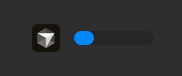
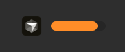
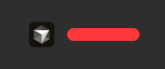
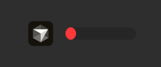
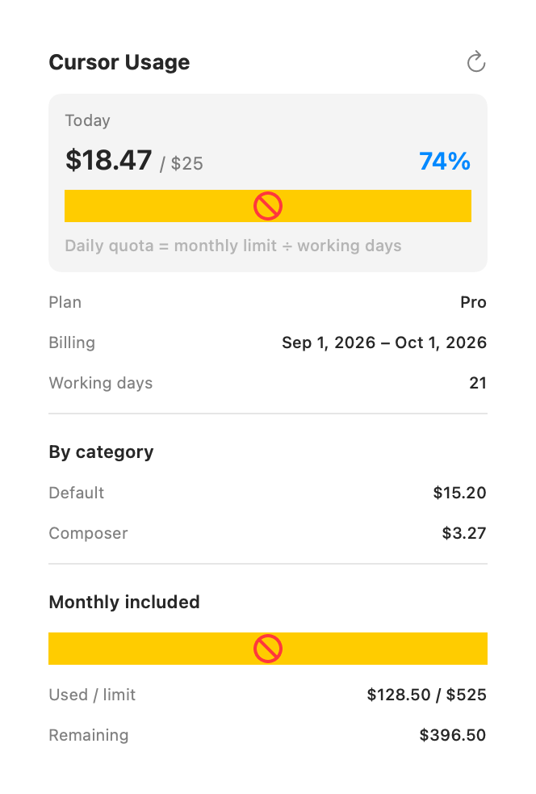

# Cursor Usage Menu Bar

A lightweight **macOS menu bar app** that shows your [Cursor](https://cursor.com) API usage at a glance — today's spend, daily quota, and monthly included usage.

No manual login, cookies, or API keys. The app reads auth from your local Cursor IDE session automatically.

## What you get

| Location | What it shows |
|----------|----------------|
| **Menu bar** | Cursor icon + color-coded progress bar (today's spend vs. daily quota) |
| **Popover** (click the icon) | Today's spend, daily quota, plan details, spend by category, monthly included usage |

The progress bar turns **blue → orange → red** as you approach and exceed your daily quota.

## Menu bar states

The icon always shows the Cursor logo plus a compact progress bar. The bar color reflects how much of today's quota you've used.

| State | When it appears | Bar color |
|-------|-----------------|-----------|
| **Loading** | App started, fetching usage data | Empty track |
| **On track** | Below 80% of daily quota | Blue |
| **Warning** | 80–99% of daily quota | Orange |
| **Over quota** | At or above 100% of daily quota | Red (full bar) |
| **Error** | Auth failure or API error | Red indicator |

### Loading

Waiting for the first usage fetch after launch.



### On track (below 80%)

Plenty of daily quota remaining.



### Warning (80–99%)

Approaching today's daily quota.



### Over quota (100% or more)

Today's spend has reached or exceeded the calculated daily quota.



### Error

Could not load usage — usually means Cursor IDE is not signed in or the session expired.



Light-mode variants are in [`docs/screenshots/`](docs/screenshots/) (`*-light.png`).

## Popover details

Click the menu bar icon to open the usage popover:



The popover shows:

- **Today** — spend vs. daily quota with percentage and progress bar
- **Plan** — your Cursor membership type
- **Billing** — current billing cycle dates
- **Working days** — count used to calculate the daily quota
- **By category** — today's spend broken down (when available)
- **Monthly included** — overall monthly usage vs. limit

*Screenshot uses sample data for illustration.*

## Requirements

- macOS 13 (Ventura) or later
- [Cursor](https://cursor.com) desktop app installed and **signed in**
- Xcode Command Line Tools (for `swift build`)

## Install

```bash
git clone git@github.com:nishantshakya/cursor-usage.git
cd cursor-usage
chmod +x install.sh build.sh
./install.sh
```

`install.sh` will:

1. Stop any running instance
2. Build the app
3. Copy it to `/Applications/Cursor Usage.app`
4. Launch it

Look for the Cursor icon and progress bar in your menu bar. Click it to open the usage popover.

## Optional configuration

Create `~/.cursor-usage/config.json` (or run `./setup-config.sh`):

```json
{
  "refreshIntervalMinutes": 15
}
```

The app refreshes usage data on this interval (default: 15 minutes). You can also click the refresh button in the popover.

## How daily quota is calculated

Cursor bills on a monthly included limit. This app spreads that limit across **working days** in the current month:

```
daily quota = monthly included limit ÷ working days in current month
```

Working days exclude weekends and US federal holidays (e.g. Labor Day, Thanksgiving).

## How authentication works

The app reads your Cursor session from the local IDE database:

```
~/Library/Application Support/Cursor/User/globalStorage/state.vscdb
```

If a session expires, the app refreshes it via Cursor's OAuth endpoint. The OAuth client ID is read from your installed Cursor app bundle at runtime (not stored in this repository).

If Cursor is installed and you are signed in, no extra setup is needed. If auth fails, open Cursor and sign in, then restart this app.

## Data sources

- `https://cursor.com/api/usage-summary`
- `https://cursor.com/api/dashboard/get-daily-spend-by-category`

## Rebuild after changes

```bash
./install.sh
```

Or build without installing:

```bash
./build.sh
open ".build/Cursor Usage.app"
```

## Menu bar icon

The build script copies `Cursor.icns` from your installed Cursor IDE. The icon is **not** bundled in this repository (trademark/branding). If Cursor is not installed, the menu bar shows the progress bar only.

Regenerate README screenshots after UI changes:

```bash
./scripts/generate-screenshots.sh
```

## Uninstall

```bash
pkill -x CursorUsage
rm -rf "/Applications/Cursor Usage.app"
rm -rf ~/.cursor-usage   # optional — removes local config
```

## Disclaimer

This is an **unofficial** community tool. It is not affiliated with or endorsed by Cursor. Usage data comes from Cursor's APIs and may change if those APIs change.
